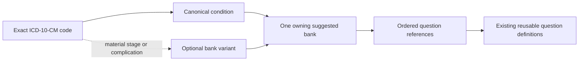

# Condition-Specific Suggested Question Banks

## Purpose

The coordinator selects an exact ICD-10-CM diagnosis and receives one condition-specific suggested question list. The coordinator can include or exclude optional questions without seeing canonical IDs, clinical content groups, variants, modules, or reuse internals.

This architecture does not create clinical questions. It references the existing reusable question registry and keeps question text, validation, branching, versions, and follow-up behavior in that registry only.

## Data Model

Every canonical condition owns exactly one `CanonicalSuggestedQuestionBank`.

The bank contains:

- A stable bank ID derived from the canonical condition ID.
- A coordinator-facing display name.
- Ordered references to existing question IDs.
- Optional variants for management-changing stages, severity, complications, or treatment states.
- No question text or duplicated question definitions.

Each question reference stores only:

- `questionId`
- `displayOrder`
- `defaultSelected`
- `optional`
- `recommended`
- `required`
- Optional implementation notes

The resolved builder attaches the existing question definition at runtime. Required references are selected, recommended, and not optional. Recommended optional references begin selected but can be excluded. Other optional references begin unselected.

## Resolution

The builder performs a deterministic lookup:

1. Find the exact ICD classification record.
2. Require a mapped PASS classification.
3. Resolve its canonical condition to the one owning bank.
4. Resolve an optional variant from the clinical content group.
5. Merge base and variant question references.
6. Apply a curated bank override without changing question definitions.
7. Sort by display order and attach definitions from the existing registry.
8. Return a coordinator-facing heading based on the selected diagnosis title.

An unmapped PASS, UNSURE, or FAIL code does not silently receive a bank. Those paths remain subject to the existing review and authorized override rules.

## Laterality Collapse

Laterality never appears in a bank ID or variant ID.

| Exact selections | Internal result |
| --- | --- |
| `M17.11` right knee osteoarthritis | `ccm-bank.osteoarthritis` |
| `M17.12` left knee osteoarthritis | `ccm-bank.osteoarthritis` |
| `M17.0` bilateral knee osteoarthritis | `ccm-bank.osteoarthritis` |
| `H40.1111` right-eye mild glaucoma | `ccm-bank.glaucoma`, base variant |
| `H40.1121` left-eye mild glaucoma | `ccm-bank.glaucoma`, base variant |

The heading can retain the selected diagnosis wording for coordinator clarity while all codes reuse the same internal bank and question references.

## Severity And Complications

Variants live inside the one owning canonical bank. They add references only when the workflow meaningfully changes.

| Canonical bank | Base or variant | Trigger |
| --- | --- | --- |
| Chronic kidney disease | Base | CKD general and stage 1-3 groups |
| Chronic kidney disease | `advanced_stage` | Stage 4-5 content group |
| Chronic kidney disease | `dialysis` | ESRD/dialysis content group |
| Diabetes | Base | Without a management-changing complication |
| Diabetes | `kidney_complication` | Diabetic kidney disease |
| Diabetes | `ophthalmic_complication` | Retinopathy/ophthalmic groups |
| Diabetes | `foot_ulcer` | Diabetic foot-ulcer group |
| Glaucoma | Base | Mild, moderate, indeterminate, or unspecified severity |
| Glaucoma | `severe` | Severe-stage groups, independent of eye side |
| Malignancy | Explicit variants | Active treatment, surveillance, or metastatic state when that context is available |

Coding specificity, encounter extension, wording, and side do not activate variants.

## Question Reuse

The architecture currently has 46 canonical banks and 20 variants. They contain 337 references to 28 of the existing 49 reusable questions. Twenty-three referenced questions are reused in more than one bank.

Commonly reused IDs include medication access/adherence, functional status, falls, pain, sleep, transportation, specialist follow-up, hospitalization, care coordination, and patient goals. Reuse means repeating a stable question ID reference; it never copies question text or behavior.

## Validation

Catalog validation rejects:

- Duplicate bank IDs.
- More than one bank for a canonical condition.
- Duplicate question references within a base bank or resolved variant.
- Orphan question IDs.
- Orphan canonical condition IDs.
- Orphan clinical content group IDs.
- Laterality in bank or variant identity.
- Empty banks or empty declared variants.
- Canonical conditions with no owning bank.
- Duplicate or conflicting display orders.
- A clinical content group assigned to multiple variants.
- Invalid required/recommended/optional flag combinations.
- Overrides targeting missing banks or missing references.

Question reuse across different canonical banks is valid and expected.

## Future Generation

Future generation is constrained to the canonical boundary:

1. Add or approve one canonical condition.
2. Create exactly one suggested-bank object with a deterministic `ccm-bank.<canonical-id>` identity.
3. Search the reusable question registry by tags, categories, contexts, and existing condition usage.
4. Reference existing questions whenever they cover the needed concept.
5. Add a variant only when stage, severity, complication, treatment burden, or care-plan workflow changes.
6. Author a genuinely new question only when no existing reusable definition covers the need.
7. Validate the complete catalog before publishing the bank.

Large-scale generation should iterate over canonical conditions, never ICD codes or laterality variants. The current architecture is ready for that controlled process, but the clinical selections in architecture-seed banks still require condition-by-condition review before publication.
